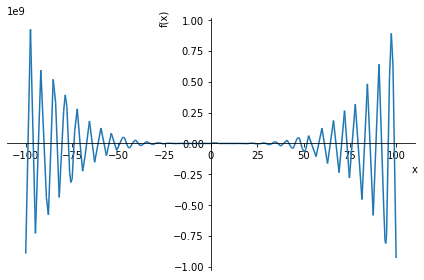

# Домашнее задание 11

##  1. Определить корни 

    Функция имеет бесконечное множество корней.

## 2. Найти интервалы, на которых функция возрастает

    Функция возрастает на бесконечном множестве интервалов.

## 3. Найти интервалы, на которых функция убывает

    Функция убывает на бесконечном множестве интервалов.

## 4. Построить график

## 5. Вычислить вершину

    Функция имеет бесконечное множество вершин.

## 6. Определить промежутки, на котором f > 0

    f > 0 на бесконечном множестве промежутков.

## 7. Определить промежутки, на котором f < 0

    f < 0 на бесконечном множестве промежутков.